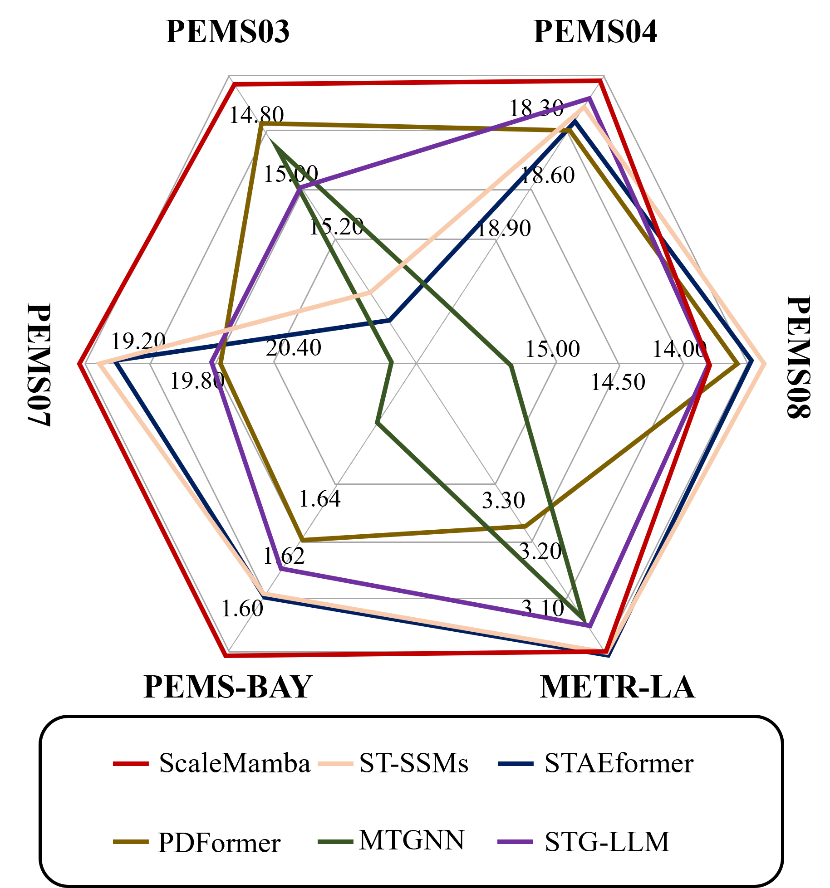

## ScaleMamba: Multi-Scale Graph State Space Learning for Traffic Forecasting in Urban IoT Networks

<div align="center">
  
</div>

<!-- <div align="center">
  
</div> -->

##run
First, you need to compress the data set. For example, when running PEMSBY, adjust the parameters in prepare.py if speed_sequences.shape[2] > 325: speed_sequences = speed_sequences[:, :, :325] and the parameter mamba_features=325 in train_ScaleMamba. This corresponds to the characteristics of the specific data set. For example, PESMBY is 325, and metr-la is 207. You need to adjust it and run the code.

```bash
#PEMS04
  python main.py -dataset=pems04 -model=ScaleMamba -mamba_features=307
```

```bash
#PESMSBY
  python main.py -dataset=PEMSBY -model=ScaleMamba -mamba_features=325
```

```bash
#metr-la
  python main.py -dataset=metr-la -model=ScaleMamba -mamba_features=207
```
